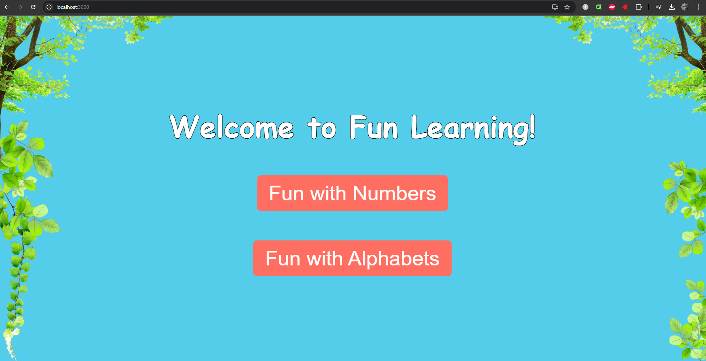

# Kids Learning Game 🎮

A fun and interactive educational mini-project designed for kids, featuring two games: a number sequence game and an alphabet sequence game. The project showcases animations, responsive UI/UX, and drag-and-drop functionality.

## Features
- **Landing Page**: Choose between a Number Game or Alphabet Game.
- **Drag and Drop**: Intuitive drag-and-drop interface with sound effects.
- **Interactive Feedback**: Fireworks animation and sound for correct answers, and error messages for wrong answers.
- **Score Tracking**: Displays a score summary at the end of the game.
- **Responsive Design**: Optimized for mobile and desktop devices.
- **Custom Animations**: Includes a unique loading bar and vibrant UI.

---

## Instructions to Run the App Locally

### Prerequisites
- Node.js (v14 or higher)
- npm or yarn installed

### Steps to Run
1. Clone the repository:
   ```bash
   git clone https://github.com/MrWalker27/kids-learning-game.git

2. Navigate to the project directory
   cd kids-learning-game

3. Install dependencies:
   npm install

4. Start the development server:
   npm start

5. Open your browser and visit:
   http://localhost:3000

## Technical Choices and Design:
- **Framework**: Used React.js for its component-based structure and efficient state management.
- **Styling**: CSS modules for scoped styling and animations.
- **Drag-and-Drop**: Implemented HTML5 drag-and-drop API for user interaction.
- **Responsive Design**: Media queries ensure the app is fully functional on both desktop and mobile screens.
- **Sound Effects**: Added engaging audio feedback using the HTML <audio> element.
- **Annimations**: Created a visually appealing experience using CSS keyframes and transitions.

